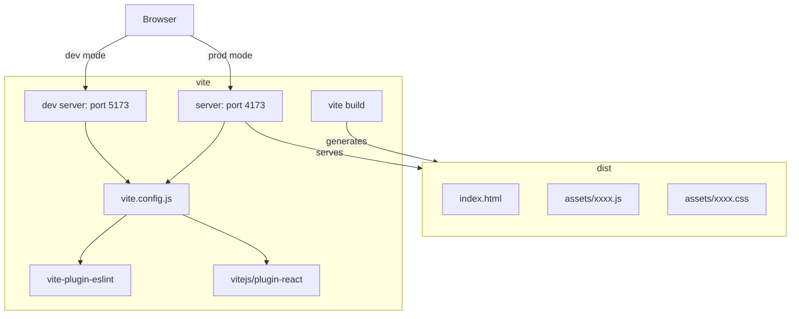

# React concepts

```mermaid
%%{init: {"flowchart": {"htmlLabels": false}} }%%
flowchart TB
    subgraph vite
        direction TB
        viteserver[dev server: port 5173] --> viteconfig[vite.config.js]
        vitepreview[server: port 4173] --> viteconfig
        viteconfig --> viteplugineslint[vite-plugin-eslint]
        viteconfig --> vitejspluginreact[vitejs/plugin-react]
        vitebuild[vite build]
    end
    subgraph dist
        direction TB
        index.html
        assets/xxxx.js
        assets/xxxx.css
    end
    vitebuild --generates--> dist
    vitepreview --serves--> dist
    Browser --dev mode--> viteserver
    Browser --prod mode--> vitepreview
```
