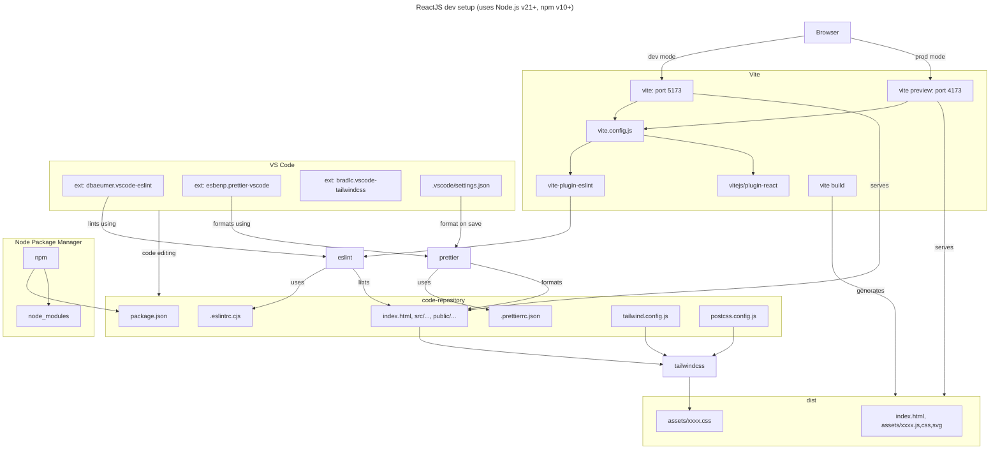

# React concepts

NOTE: The example app in this repository is based on [Brian Holt's React course on Frontend Masters](https://frontendmasters.com/courses/intermediate-react-v5/).

## Table of contents

1. [ReactJS dev setup](#reactjs-dev-setup-toc)

<details open>
  <summary>
  
  ## ReactJS dev setup [[TOC]](#table-of-contents)
  
  </summary>

We will be creating a basic ReactJS dev setup using:

- [Vite](https://vitejs.dev/) as the build tool and local dev server. It enables rapid development by leveraging native ES module imports, offers HMR for instantaneous updates, and provides optimized bundling for production deployment.
- [ESLint](https://eslint.org/) for static code analysis. It identifies and fix code errors, maintain code consistency, and enforce coding standards.
- [Prettier](https://prettier.io/) for code formatting. It automatically formats code in a consistent style (opinionated), simplifying the process of maintaining a cohesive codebase across dev teams.
- [Tailwind CSS](https://tailwindcss.com/) as CSS framework. It is a utility-first CSS framework that streamlines web development by providing a comprehensive set of pre-designed utility classes for styling HTML elements.
- [VS Code](https://code.visualstudio.com/) as the code editor. It includes extensions for ESLint, Prettier etc.
- [npm](https://www.npmjs.com/) as the JavaScript package manager.

Below is a high-level diagram that depicts how all the above pieces fit together:



Follow the below steps to create the above setup:

1.  Create React app using Vite's React template. Change `myreactapp` app name to your own custom name.

    ```sh
     npm create vite@latest myreactapp -- --template react
    ```

2.  npm install all dependencies:

    ```sh
    cd myreactapp
    npm i
    ```

3.  Install Vite's ESLint plugin and Prettier.

    ```sh
    npm i -D vite-plugin-eslint prettier
    ```

4.  Configure Prettier:

    - Create Prettier config file i.e. `.prettierrc.json` with an empty config object i.e. `{}`. Install [Prettier VS Code extension](https://marketplace.visualstudio.com/items?itemName=esbenp.prettier-vscode). Refer [.prettierrc](./.prettierrc.json).

    - Add [@trivago/prettier-plugin-sort-imports](https://github.com/trivago/prettier-plugin-sort-imports) prettier plugin to sort and organize imports. Add the following configuration to `.prettierrc.json`. Refer [.prettierrc.json](./.prettierrc.json).

    ```json
    {
      "importOrderSeparation": true,
      "importOrderSortSpecifiers": true,
      "plugins": ["@trivago/prettier-plugin-sort-imports"]
    }
    ```

    - Configure VS Code to format on save using Prettier. Create `.vscode` folder to save workspace
      settings. Create `.vscode/settings.json` file to configure workspace settings. Refer [.vscode/settings.json](./.vscode/settings.json). Following are the relevant lines to configure format on save using prettier:
      ```json
      {
        "editor.defaultFormatter": "esbenp.prettier-vscode",
        "editor.formatOnSave": true,
        "eslint.run": "onSave",
        "[html]": {
          "editor.defaultFormatter": "esbenp.prettier-vscode",
          "editor.formatOnSave": true
        },
        "prettier.requireConfig": true
      }
      ```

5.  Configure ESLint

    - Update `vite.config.js` to include eslint plugin. Add `import eslint from "vite-plugin-eslint";` and call `eslint()` inside `plugins` array. Refer [vite.config.js](./vite.config.js).

    - Further, install [ESLint VS Code extension](https://marketplace.visualstudio.com/items?itemName=dbaeumer.vscode-eslint).

    - Install ESLint plugins for a11y and Prettier.

      ```sh
      npm install -D eslint-plugin-jsx-a11y eslint-plugin-prettier eslint-config-prettier
      ```

    - Refer [.eslintrc.cjs](./.eslintrc.cjs) and update following entries:
      ```js
      module.exports = {
        // Snip
        extends: ["plugin:jsx-a11y/recommended", "plugin:prettier/recommended"],
        plugins: ["react-refresh", "jsx-a11y"],
        // Snip
      };
      ```

6.  Configure Tailwind CSS

    - Install `tailwindcss` along with its peer dependencies, and generate `tailwind.config.js` and `postcss.config.js` files.

      ```sh
      npm install -D tailwindcss postcss autoprefixer
      npx tailwindcss init -p
      ```

    - Update `content` settings in `tailwind.config.js` file. Refer [tailwind.config.js](./tailwind.config.js).

      ```json
      {
        "content": ["./index.html", "./src/**/*.{js,ts,jsx,tsx}"]
      }
      ```

    - Add the @tailwind directives for each of Tailwind’s layers inside [./src/index.css](./src/index.css) file.

      ```css
      @tailwind base;
      @tailwind components;
      @tailwind utilities;
      ```

    - Install [Tailwind CSS Intellisense extension](https://marketplace.visualstudio.com/items?itemName=bradlc.vscode-tailwindcss)

    - Add [prettier-plugin-tailwindcss](https://github.com/tailwindlabs/prettier-plugin-tailwindcss) prettier plugin to automatically sorts classes based on [recommended class order](https://tailwindcss.com/blog/automatic-class-sorting-with-prettier#how-classes-are-sorted). Update `plugins` property in [.prettierrc.json](./.prettierrc.json).

      ```json
      {
        "plugins": ["prettier-plugin-tailwindcss"]
      }
      ```

7.  Add the following `format` command inside `"scripts"` config property of the `package.json` file in order to format files using prettier using CLI. Refer [package.json](./package.json) file.

    ```json
    {
      "scripts": {
        "format": "prettier --write \"src/**/*.{js,jsx,ts,tsx}\""
      }
    }
    ```

8.  Run Vite dev server and visite [http://localhost:5173](http://localhost:5173) to access the newly configured app.
    ```sh
    npm run dev
    ```

</details>
