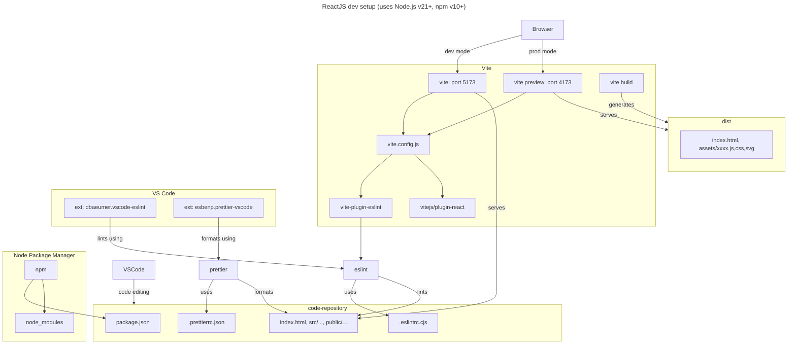

# React concepts

Below is a basic ReactJS dev setup using:

- [Vite](https://vitejs.dev/) as the build tool and local dev server. It enables rapid development by leveraging native ES module imports, offers HMR for instantaneous updates, and provides optimized bundling for production deployment.
- [ESLint](https://eslint.org/) for static code analysis. It identifies and fix code errors, maintain code consistency, and enforce coding standards.
- [Prettier](https://prettier.io/) for code formatting. It automatically formats code in a consistent style (opinionated), simplifying the process of maintaining a cohesive codebase across dev teams.
- [VSCode](https://code.visualstudio.com/) as the code editor. It includes extensions for ESLint, Prettier etc.
- [npm](https://www.npmjs.com/) as the JavaScript package manager.

