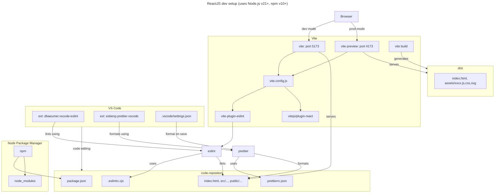

# React concepts

## Table of contents

1. [ReactJS dev setup](#reactjs-dev-setup)

<details open>
  <summary>
  
  ## ReactJS dev setup [[TOC]](#table-of-contents)
  
  </summary>

We will be creating a basic ReactJS dev setup using:

- [Vite](https://vitejs.dev/) as the build tool and local dev server. It enables rapid development by leveraging native ES module imports, offers HMR for instantaneous updates, and provides optimized bundling for production deployment.
- [ESLint](https://eslint.org/) for static code analysis. It identifies and fix code errors, maintain code consistency, and enforce coding standards.
- [Prettier](https://prettier.io/) for code formatting. It automatically formats code in a consistent style (opinionated), simplifying the process of maintaining a cohesive codebase across dev teams.
- [VSCode](https://code.visualstudio.com/) as the code editor. It includes extensions for ESLint, Prettier etc.
- [npm](https://www.npmjs.com/) as the JavaScript package manager.

Below is a high-level diagram that depicts how all the above pieces fit together:



Follow the below steps to create the above setup:

1. Create React app using Vite's React template. Change `myreactapp` app name to your own custom name.
   ```sh
    npm create vite@latest myreactapp -- --template react
   ```
2. npm install all dependencies:
   ```sh
   cd myreactapp
   npm i
   ```
3. Install Vite's ESLint plugin and Prettier.
   ```sh
   npm i -D vite-plugin-eslint prettier
   ```
4. Configure Prettier:

   - Create Prettier config file i.e. `.prettierrc.json` with an empty config object i.e. `{}`. Install [Prettier VS Code extension](https://marketplace.visualstudio.com/items?itemName=esbenp.prettier-vscode). Refer [.prettierrc](./.prettierrc.json).
   - Configure VS Code to format on save using Prettier. Create `.vscode` folder to save workspace
     settings. Create `.vscode/settings.json` file to configure workspace settings. Refer [.vscode/settings.json](./.vscode/settings.json). Following are the relevant lines to configure format on save using prettier:
     ```json
     {
       "editor.defaultFormatter": "esbenp.prettier-vscode",
       "editor.formatOnSave": true,
       "eslint.run": "onSave",
       "[html]": {
         "editor.defaultFormatter": "esbenp.prettier-vscode",
         "editor.formatOnSave": true
       },
       "prettier.requireConfig": true
     }
     ```

5. Configure ESLint
   - Update `vite.config.js` to include eslint plugin. Add `import eslint from "vite-plugin-eslint";` and call `eslint()` inside `plugins` array. Refer [vite.config.js](./vite.config.js).
   - Further, install [ESLint VS Code extension](https://marketplace.visualstudio.com/items?itemName=dbaeumer.vscode-eslint).
6. Add the following `format` command inside `"scripts"` config property of the `package.json` file in order to format files using prettier using CLI. Refer [package.json](./package.json) file.
   ```json
   {
     "scripts": {
       "format": "prettier --write \"src/**/*.{js,jsx,ts,tsx}\""
     }
   }
   ```
7. Run Vite dev server and visite [http://localhost:5173](http://localhost:5173) to access the newly configured app.
   ```sh
   npm run dev
   ```

</details>
